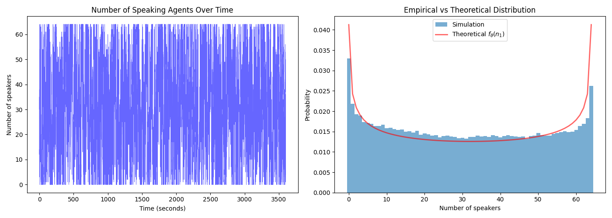
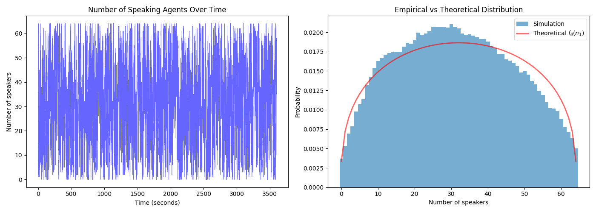

# A Model of Silence（An Angel Passes モデル）

> This README is generated by ChatGPT.

  
*Parameters: N = 64, α = 0.002000, β = 0.002000, θ = 0.8000*

  
*Parameters: N = 64, α = 0.002000, β = 0.002000, θ = 0.9000*

このリポジトリは、論文「A Model of Silence, or the Probability of *Un Ange Passe*」で提案された数理モデルとそのシミュレーションコードを含んでいます。

このモデルは、複数人が同じ空間に存在する際に突然発生する沈黙（いわゆる “天使が通る” 状態）を、マルコフ連鎖と相互作用行列を用いて再現するものです。カフェや教室のような実空間における会話のダイナミクスを、定量的に解析するための基盤を提供します。

---

## 🧠 論文情報

- **タイトル**: A Model of Silence, or the Probability of *Un Ange Passe*
- **日付**: 2025年4月12日
- **arXiv**: 

---

## 📦 内容物

- `run.py`：Pythonによるシミュレーションコード（状態更新、可視化、理論分布との比較など）
- `angel_passes.f90`：Fortranによる状態更新ルーチン
- `Makefile`：`libfort.so`（共有ライブラリ）のビルド用
- `libfort.so`：コンパイル済みFortranライブラリ（ビルド後に生成されます）
- `fig/`：シミュレーション結果の図（例）

---

## 🚀 実行方法

### 1. Fortranライブラリのビルド（必須）

このプロジェクトでは Fortran（gfortran）を使用しています。  
以下のように `Makefile` を使って共有ライブラリをビルドしてください：

```bash
make         # 最適化ビルド
make debug   # デバッグビルド（境界チェックなど有効）
make clean   # クリーンアップ
```

> ⚠️ `Makefile` は `gfortran` を前提に書かれています。他のFortranコンパイラを使用する場合は適宜修正してください。

### 2. シミュレーションの実行

```bash
python run.py
```

実行後、以下が出力されます：
- モデルのパラメータと導出された期待値
- 発話人数の時系列プロット
- シミュレーション結果と理論分布の比較図（Matplotlib）

---

## 📊 モデル概要

- 各エージェントは「発話 (1)」または「沈黙 (0)」の2状態を持ちます。
- 遷移確率は自身の状態と周囲からの影響（重み行列）に基づいて決まります。
- 「カフェθモデル」と呼ばれる補間モデルを用いて、孤立〜完全連動の間を連続的に表現します。
- θの値が臨界点を超えると、沈黙が突然消失する**相転移的現象**が観測されます。

---

## 📝 注意事項

- `run.py` 冒頭に記載されている通り、このコードは ChatGPT によりリファクタリングされています。
- `Expected silence duration (*)` など一部の出力値は、相互作用を無視した理想化モデルに基づく参考値です。

---

## 📖 ライセンス

このリポジトリは [MIT License](./LICENSE) のもとで公開されています。  

---

## ✉️ お問い合わせ

ご質問・フィードバック等は、以下の Twitter アカウントまでお気軽にどうぞ：  
🔗 [@alife_praparat](https://twitter.com/alife_praparat)

